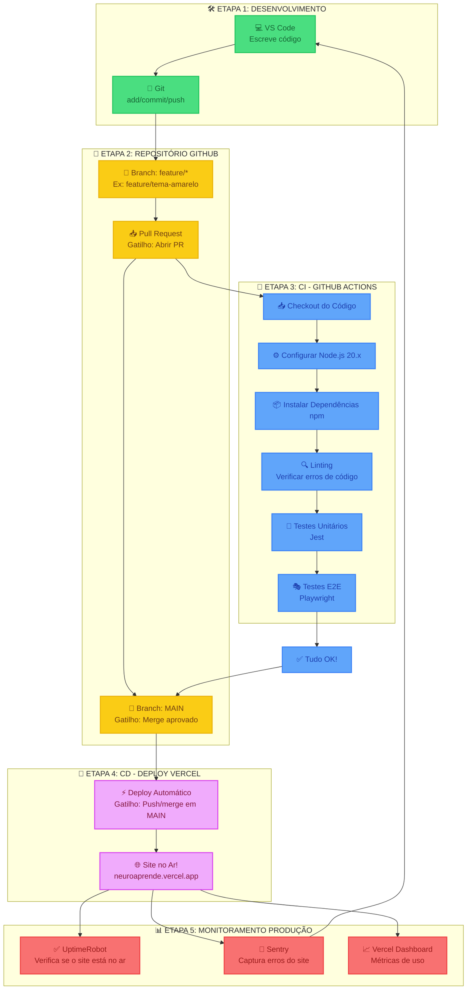

# 🗺️ Mapa da Esteira DevOps - NEUROAPRENDE

```mermaid
flowchart TD
    %% Definindo estilos bonitos
    classDef dev fill:#4ade80,stroke:#22c55e,stroke-width:2px,color:#166534;
    classDef repo fill:#facc15,stroke:#eab308,stroke-width:2px,color:#713f12;
    classDef ci fill:#60a5fa,stroke:#3b82f6,stroke-width:2px,color:#1e40af;
    classDef cd fill:#f0abfc,stroke:#d946ef,stroke-width:2px,color:#831843;
    classDef prod fill:#38bdf8,stroke:#0ea5e9,stroke-width:2px,color:#075985;
    classDef monitor fill:#f87171,stroke:#ef4444,stroke-width:2px,color:#991b1b;

    subgraph "🛠️ ETAPA 1: DESENVOLVIMENTO"
        direction TB
        A["💻 VS Code<br>Escreve código"]
        B["🔄 Git<br>add/commit/push"]
        A --> B
    end

    subgraph "📂 ETAPA 2: REPOSITÓRIO GITHUB"
        direction TB
        C["🌿 Branch: feature/*<br>Ex: feature/tema-amarelo"]
        D["📥 Pull Request<br>Gatilho: Abrir PR"]
        E["🌿 Branch: MAIN<br>Gatilho: Merge aprovado"]
        C --> D
        D --> E
    end

    subgraph "🤖 ETAPA 3: CI - GITHUB ACTIONS"
        direction TB
        F["📥 Checkout do Código"]
        G["⚙️ Configurar Node.js 20.x"]
        H["📦 Instalar Dependências npm"]
        I["🔍 Linting<br>Verificar erros de código"]
        J["🧪 Testes Unitários<br>Jest"]
        K["🎭 Testes E2E<br>Playwright"]
        F --> G
        G --> H
        H --> I
        I --> J
        J --> K
    end

    subgraph "🚀 ETAPA 4: CD - DEPLOY VERCEL"
        direction TB
        L["⚡ Deploy Automático<br>Gatilho: Push/merge em MAIN"]
        M["🌐 Site no Ar!<br>neuroaprende.vercel.app"]
        L --> M
    end

    subgraph "📊 ETAPA 5: MONITORAMENTO PRODUÇÃO"
        direction TB
        N["✅ UptimeRobot<br>Verifica se o site está no ar"]
        O["🐛 Sentry<br>Captura erros do site"]
        P["📈 Vercel Dashboard<br>Métricas de uso"]
    end

    %% Conectando as etapas (CORRIGIDO!)
    B --> C
    D --> F
    K --> L1
    L1["✅ Tudo OK!"]
    L1 --> E
    E --> L
    M --> N
    M --> O
    M --> P
    O --> A

    %% Aplicando estilos
    class A,B dev;
    class C,D,E repo;
    class F,G,H,I,J,K,L1 ci;
    class L,M cd;
    class N,O,P monitor;
```
